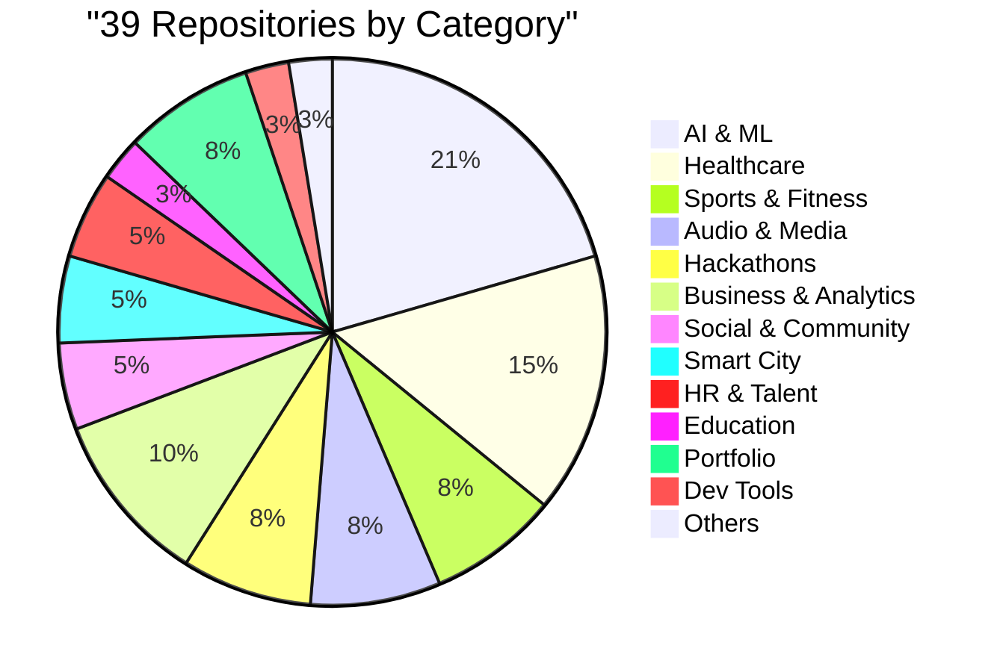

<div align="center">


[](https://git.io/typing-svg)

<p align="center">
  <a href="https://github.com/raazi29">
    
  </a>
  
  
  
</p>


<br/>

### 👋 Welcome to my digital playground!


</div>

<br/>


##  About Me

<div align="center">

<table border="0">
<tr>
<td width="50%" valign="top">


###  Developer Profile

| | |
|:---|:---|
| **Name** | Raazi |
| **Role** | AI/ML & Full-Stack Developer |
| **Location** | 🇮🇳 India |
| **Status** | 💼 Open to Work |
| **Email** | 📧 raazib76@gmail.com |

<br/>

**📊 GitHub Statistics:**
```text
📦 39 Total Repositories (17 Public + 22 Private)
🔥 404+ Contributions (Last Year) - Still counting!
⭐ 41 Stars Earned - Collecting them like Pokémon
👥 6 Followers - Quality over quantity! 😎
🏅 GitHub Pro Member - Living the pro life
```


</td>
<td width="50%" valign="top">

###  Technical Stack

**🤖 AI & Machine Learning**
```yaml
LLM Integration: OpenAI, Anthropic
Frameworks: TensorFlow, PyTorch
Tools: Hugging Face
```

**💻 Full-Stack Development**
```yaml
Frontend: React, Next.js, TypeScript
Backend: Node.js, Python
Mobile: Flutter, Dart
Database: MongoDB, PostgreSQL
Cloud: Firebase
```

**🛠️ Tools & Practices**
```yaml
Version Control: Git, GitHub
DevOps: Docker
IDE: VS Code
Methodology: Agile
```

</td>
</tr>
</table>

</div>


<div align="center">

###  GitHub Achievements


</div>

<div align="center">

###  Technology Stack


<br/>


</div>


##  Core Competencies

<div align="center">

<table>
<tr>
<td align="center" width="33%">
<br/>
<b>AI/ML Development</b><br/>
AI Integration<br/>
LLM Applications<br/>
Rapid Prototyping
</td>
<td align="center" width="33%">
<br/>
<b>Mobile Development</b><br/>
Flutter/Dart<br/>
Cross-Platform Apps<br/>
Healthcare & Sports Tech
</td>
<td align="center" width="33%">
<br/>
<b>Web Development</b><br/>
Full-Stack Applications<br/>
React/Next.js<br/>
TypeScript/JavaScript
</td>
</tr>
</table>

</div>


##  Project Portfolio Breakdown

<div align="center">



### 📊 The Numbers Game


<table>
<tr>
<td width="33%" align="center">

**Languages**
- TypeScript: 18 repos
- Python: 9 repos
- Dart: 3 repos
- JavaScript: 2 repos
- HTML: 1 repo

</td>
<td width="33%" align="center">

**Visibility**
- Public: 17 (44%)
- Private: 22 (56%)
- Archived: 1
- Forked: 4

</td>
<td width="33%" align="center">

**Licenses**
- MIT License: 8 repos
- Open Source: 17 repos
- Proprietary: 22 repos
- Active: 38 repos

</td>
</tr>
</table>

</div>


##  Featured Projects

<div align="center">

### Spotlight Projects

<table>
<tr>
<td width="50%">

[](https://github.com/raazi29/AI-Architect)

</td>
<td width="50%">

[](https://github.com/raazi29/SubwayAI)

</td>
</tr>
<tr>
<td width="50%">

[](https://github.com/raazi29/portfolio)

</td>
<td width="50%">

[](https://github.com/raazi29/Sparkathon25)

</td>
</tr>
<tr>
<td width="50%">

[](https://github.com/raazi29/retailverse)

</td>
<td width="50%">

[](https://github.com/raazi29/mindmate-flow)

</td>
</tr>
</table>

### Complete Repository Collection (39 Total)

<details>
<summary>Click to explore all 39 repositories (17 Public + 22 Private)</summary>
<br/>

#### AI & Machine Learning (8 Projects)
- **GitMateAI** `TypeScript` `MIT License` `Private` - AI-Powered Git Assistant
- **AI-Architect** `TypeScript` `3 Forks` `Public` - AI Architecture Solutions
- **AI-Advisor** `Python` `Private` - Intelligent Advisory System
- **AIchitect** `Dart` `Private` - Mobile AI Architecture App
- **SubwayAI** `Python` `Public` - AI-Powered Transit Navigation
- **GitMateAI-P** `TypeScript` `Private` - GitMate Production Version
- **GitMateAI-landing** `TypeScript` `Private` - Landing Page for GitMateAI
- **Qwentest** `HTML` `Private` - AI Model Testing Platform

#### Portfolio & Personal (3 Projects)
- **Portfolio** `TypeScript` `Public` - Personal Portfolio Website
- **raazi29.github.io** `Public` - GitHub Pages Personal Site
- **Readme** `MIT License` `Private` - Profile README Repository

#### Hackathon & Competition Projects (3 Projects)
- **Sparkathon25** `TypeScript` `Public` - Hackathon Solution 2025
- **Hackathon2025app** `Python` `MIT License` `Public` - Healthcare Innovation
- **Aarambh** `TypeScript` `Public` - Forked from peterdig/Aarambh

#### E-Commerce & Business (3 Projects)
- **RetailVerse** `TypeScript` `1 Fork` `Public` - Retail Solutions Platform
- **Karmalyze.in** `TypeScript` `Private` - Business Analytics Platform
- **Karmalyze** `Python` `Private` - Backend for Karmalyze Platform

#### Mental Health & Wellness (2 Projects)
- **MindMate Flow** `MIT License` `Public` - Mental Health Tracking
- **MindMate Emotions Flow** `TypeScript` `2 Forks` `MIT License` `Public` - Emotion Tracking

#### Audio & Media (4 Projects)
- **Audio Stem Journey** `Python` `Public` - Audio Processing & Stem Separation
- **raga-recognition-engine** `TypeScript` `Private` - Indian Classical Music Recognition
- **stem-access-hub** `TypeScript` `Private` - Audio Stem Management
- **streampulse** `Dart` `Private` - Live Streaming Platform

#### Social & Community (2 Projects)
- **Sapna Rasta Connect** `TypeScript` `Public` - Social Connection Platform
- **Snotion** `JavaScript` `Private` - Social Notion Integration

#### HR & Talent Management (2 Projects)
- **TalentScout** `Python` `MIT License` `Public` - AI-Powered Talent Management
- **japan-job-whisperer** `TypeScript` `Private` - Japan Job Market Platform

#### Education Technology (1 Project)
- **Edu Genie Lab** `TypeScript` `MIT License` `Public` - Educational Platform

#### Healthcare Solutions (6 Projects)
- **healthbrighter** `TypeScript` `Private` - Healthcare Wellness Platform
- **Medic** `Python` `Public` - Forked from AshwinKumarBV-git/medic
- **Medbo** `Public` - Healthcare Management System
- **medbot-chat-assist** `TypeScript` `Private` - Medical Chatbot Assistant
- **clininc** `TypeScript` `Private` - Clinic Management System
- **hea** `Private` - Healthcare Application

#### Sports & Fitness (2 Projects)
- **AthleteX** `Dart` `Private` - Athlete Performance Tracking
- **Athletrix** `TypeScript` `Private` - Sports Analytics Platform

#### Smart City & Environment (2 Projects)
- **MirraOS** `TypeScript` `Private` - Smart Mirror Operating System
- **commGREEN-MAP** `Private` - Community Green Mapping Platform

#### Development Tools (1 Project)
- **bolt.diy** `TypeScript` `MIT License` `Archived` - Full-stack web app builder

</details>

</div>


##  GitHub Analytics

<div align="center">


<table>
<tr>
<td width="50%">


</td>
<td width="50%">


<br/>


</td>
</tr>
<tr>
<td width="50%">


</td>
<td width="50%">


</td>
</tr>
</table>

</div>


##  Recent Activity

<div align="center">

| Date | Project | Tech | Status |
|:---|:---|:---:|:---|
| Oct 6, 2025 | **GitMateAI** | TypeScript | Active Development |
| Oct 4, 2025 | **Karmalyze.in** | TypeScript | Business Platform |
| Oct 4, 2025 | **Karmalyze** | Python | Backend Services |
| Oct 3, 2025 | **Snotion** | JavaScript | Social Integration |
| Oct 3, 2025 | **AthleteX** | Dart | Mobile App |
| Oct 1, 2025 | **healthbrighter** | TypeScript | Healthcare Platform |
| Sep 30, 2025 | **MirraOS** | TypeScript | Smart Mirror OS |
| Sep 25, 2025 | **AI-Architect** | TypeScript | Public (3 Forks) |

**🎯 Currently Working On:** 
- 🤖 AI-powered solutions
- 💊 Healthcare tech applications
- 🏙️ Smart City projects
- ☕ Learning new technologies


</div>


##  What Makes Me Tick

<div align="center">

<table>
<tr>
<td align="center" width="25%">
<br/>
<b>🤖 AI Integration</b><br/>
<sub>Integrating AI<br/>into applications</sub>
</td>
<td align="center" width="25%">
<br/>
<b>📚 Continuous Learning</b><br/>
<sub>Always curious,<br/>always exploring</sub>
</td>
<td align="center" width="25%">
<br/>
<b>🧩 Problem Solving</b><br/>
<sub>Finding solutions<br/>to challenges</sub>
</td>
<td align="center" width="25%">
<br/>
<b>🌐 Cross-Platform</b><br/>
<sub>Building for<br/>multiple platforms</sub>
</td>
</tr>
</table>

</div>

### 🎮 Fun Facts About Me

```javascript
const raazi = {
    pronouns: "he/him",
    code: ["TypeScript", "Python", "Dart", "JavaScript"],
    askMeAbout: ["AI/ML", "web dev", "mobile dev", "tech", "coffee"],
    technologies: {
        frontEnd: {
            js: ["React", "Next.js"],
            css: ["Tailwind", "Bootstrap"]
        },
        backEnd: {
            js: ["Node", "Express"],
            python: ["Flask"]
        },
        mobileApp: ["Flutter", "React Native"],
        databases: ["MongoDB", "PostgreSQL", "Redis"],
        ai: ["TensorFlow", "PyTorch", "OpenAI", "LangChain"]
    },
    currentFocus: "Building AI-powered applications",
    funFact: "I debug with console.log() and I'm not ashamed! 😄"
};
```


##  Contact & Professional Links

<div align="center">

<a href="https://www.linkedin.com/in/mohammed-raazi/">
  
</a>
<a href="https://raazi.vercel.app/">
  
</a>
<a href="https://twitter.com/raazi29">
  
</a>
<a href="mailto:raazi29@gmail.com">
  
</a>
<a href="https://github.com/raazi29">
  
</a>

<br/><br/>

### 💬 Let's Connect!


<br/>

**🎯 Open to:**
- 💼 Full-time opportunities
- 🤝 Freelance projects
- 🚀 Open source collaborations
- ☕ Coffee chats about tech


</div>

---

<div align="center">


<br/>


<p>
  <i>💡 "Code is like humor. When you have to explain it, it's bad." - Cory House</i>
</p>

<sub>⚡ Powered by coffee, curiosity, and countless Stack Overflow tabs</sub>


</div>
