# 🚀 Hey there! I'm Raazi 
### 🎯 AI-Powered Developer | Data Science Enthusiast | Prompt Engineering Wizard

<div align="center">
  


</div>

---

## 💫 About Me

```python
class AIEnthusiast:
    def __init__(self):
        self.name = "Raazi"
        self.role = "AI-Powered Developer"
        self.language_spoken = ["Python", "TypeScript", "JavaScript", "AI Prompts"]
        self.current_focus = "Building the future with AI"
        self.specialties = [
            "🔬 Data Science & Analytics",
            "🤖 AI/ML Model Development", 
            "📱 Mobile App Development",
            "🌐 Full-Stack Web Development",
            "⚡ Advanced Prompt Engineering",
            "🎯 Rapid Prototyping with AI Tools"
        ]
    
    def say_hi(self):
        print("Thanks for dropping by! Let's build something amazing together! 🚀")

me = AIEnthusiast()
me.say_hi()
```

## 🛠️ Tech Arsenal

<div align="center">

### 🔥 Core Technologies


### 🧠 AI & Data Science


### 🚀 AI Development Tools


### 🌐 Full Stack & Mobile


</div>

## 🎯 What I Do Best

<div align="center">

| 🔬 **Data Science** | 🤖 **AI Development** | 📱 **App Development** |
|:---:|:---:|:---:|
| Advanced Analytics | Custom AI Solutions | Mobile & Web Apps |
| ML Model Training | Prompt Engineering | Full-Stack Development |
| Data Visualization | AI Integration | Rapid Prototyping |

</div>

## 🚀 Featured Projects

<div align="center">

### 🏆 Recent Builds

[](https://github.com/raazi29/Sparkathon25)
[](https://github.com/raazi29/retailverse)
[](https://github.com/raazi29/mindmate-flow)
[](https://github.com/raazi29/audio-stem-journey)

</div>

## 📊 GitHub Analytics

<div align="center">
  


</div>

## 🎨 My Coding Philosophy

```mermaid
graph TD
    A[💡 Problem] --> B[🤖 AI-Assisted Analysis]
    B --> C[⚡ Smart Prompting]
    C --> D[🏗️ Rapid Development]
    D --> E[🧪 Testing & Iteration]
    E --> F[🚀 Deployment]
    F --> G[📈 Continuous Improvement]
    G --> A
```

<div align="center">



</div>

## 🌟 Why I Love AI Development

> **"I don't just code—I orchestrate AI to build solutions that seemed impossible yesterday."**

- 🎯 **Prompt Engineering Mastery**: Crafting precise prompts that unlock AI's full potential
- ⚡ **Rapid Prototyping**: From idea to MVP in record time using AI-assisted development
- 🔄 **Continuous Learning**: Always experimenting with the latest AI tools and techniques
- 🌐 **Cross-Platform**: Building for web, mobile, and beyond with AI-powered efficiency

## 🤝 Let's Connect & Build Together!

<div align="center">

[](https://linkedin.com/in/raazi29)
[](https://twitter.com/raazi29)
[](mailto:raazi29@gmail.com)

### 💬 Open to Collaborations!
*Got an interesting project? Let's chat about how AI can supercharge your ideas!*

</div>

---

<div align="center">


**⭐ Don't forget to star interesting repos! | 🔔 Following back fellow developers**

</div>

<div align="center">
  
### 🎉 Thanks for stopping by! 
*Building the future, one AI-powered solution at a time* 🚀✨

</div>
